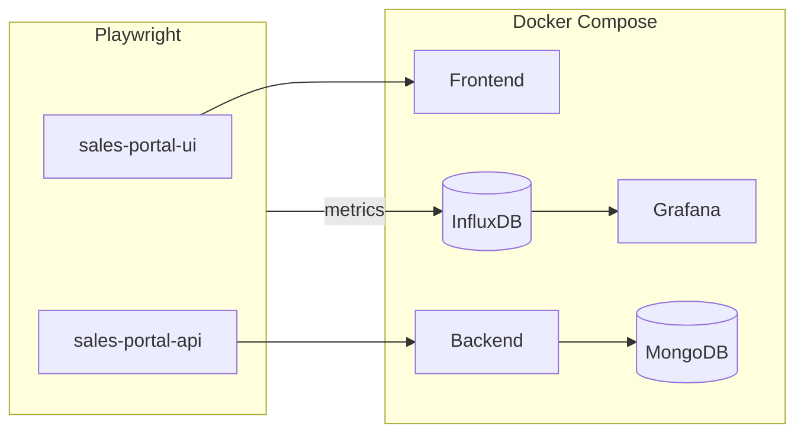

# 🎯 AQA Playwright Final Project

[](https://playwright.dev/)
[](https://www.typescriptlang.org/)
[](https://nodejs.org/)
[](https://eslint.org/)
[](https://prettier.io/)

## Overview

📌 **Final course project for Automated Quality Assurance (AQA) using Playwright and TypeScript.**  
Covers **UI tests**, **API tests**, **reporting**, and **code quality tools** against a **Sales Portal** stack (frontend + backend + MongoDB), runnable locally via **Docker Compose** or against your own deployment URLs.

The suite validates order and customer flows in a sales application: REST API checks (customers, products, orders, managers) and browser UI scenarios (orders, delivery, managers, modals). Tests rely on **shared Playwright fixtures** for API clients, factories, page objects, and a **worker-scoped JWT** to avoid duplicate logins and backend contention when running in parallel.

---

## 🏗 Architecture (high level)

| Layer                      | Role                                                                                                                                                                                                                                                                                                                                                                   |
| -------------------------- | ---------------------------------------------------------------------------------------------------------------------------------------------------------------------------------------------------------------------------------------------------------------------------------------------------------------------------------------------------------------------- |
| **Application under test** | `docker-compose.yml` brings up **MongoDB**, optional **mongo-express**, **backend** (`ghcr.io/josievi/sales-backend:latest`), **frontend** (`ghcr.io/josievi/sales-frontend:latest`), **InfluxDB** (metrics storage), and **Grafana** (metrics dashboard). Ports and secrets are driven by `.env`.                                                                     |
| **Playwright projects**    | **`sales-portal-ui`** — UI specs under `src/ui/tests`, uses worker-scoped auth cookies. **`sales-portal-api`** — API specs under `src/api/tests`, uses `APIRequestContext` with `baseURL` from config.                                                                                                                                                                 |
| **Authentication**         | No `storageState` file. Instead, `ui-auth.fixture.ts` performs **one API login per worker** and injects the JWT as a browser cookie (`workerAuthCookies`, `scope: 'worker'`). Each test gets a fresh `authPage` with those cookies applied.                                                                                                                            |
| **Fixtures**               | `controllers.fixture` → HTTP controllers; `api-services.fixture` exposes services plus **`workerToken`** (`scope: 'worker'`); `pages.fixture` → page objects; `ui-services.fixture` → UI services; `mock.fixture` → network mocking; factories (`customerFactory`, `productFactory`, `orderFactory`) and all of the above merge in `index.fixture` (composition root). |
| **Assertions**             | `fixtures/index.fixture` re-exports `expect` from `src/utils/validations/customMatchers.ts` (extended with **`toMatchSchema`** via a shared **Ajv** instance).                                                                                                                                                                                                         |
| **Metrics**                | `src/utils/reporters/InfluxReporter.ts` — custom Playwright reporter that pushes test results to **InfluxDB** for visualization in **Grafana**.                                                                                                                                                                                                                        |
| **CI**                     | `.github/workflows/playwright.yml` checks out the repo, logs into GHCR, creates `.env` from secrets, runs `docker compose up -d`, installs browsers, runs `npx playwright test`, publishes **Allure** report to **GitHub Pages**, and sends a **Slack** notification with the result.                                                                                  |



---

## 🧰 Tech stack

| Tool                                 | Notes                                                                                                     |
| ------------------------------------ | --------------------------------------------------------------------------------------------------------- |
| **Node.js**                          | >= **18.x** (`.github/workflows/playwright.yml` uses 18); **20.x LTS** recommended for local development. |
| **npm**                              | Lockfile: `package-lock.json`.                                                                            |
| **TypeScript**                       | `module` / resolution: **NodeNext** (`tsconfig.json`).                                                    |
| **@playwright/test**                 | ^1.59.x                                                                                                   |
| **ESLint 9** + **typescript-eslint** | Flat config: `eslint.config.mjs`.                                                                         |
| **Prettier**                         | `.prettierrc`, `.prettierignore`.                                                                         |
| **Allure**                           | `allure-playwright` ^3.x + `allure-commandline` for reports; history published to **GitHub Pages**.       |
| **Ajv** + **ajv-formats**            | JSON Schema validation; custom `expect` matcher.                                                          |
| **dotenv**                           | Loaded in `playwright.config.ts`.                                                                         |
| **Husky**                            | Git hooks via `npm run prepare`.                                                                          |
| **@influxdata/influxdb-client**      | Used by `InfluxReporter` to push metrics to InfluxDB.                                                     |
| **winston**                          | Logging inside utilities and reporters.                                                                   |
| **@faker-js/faker**                  | Test data generation in factories.                                                                        |
| **lodash** / **moment** / **bson**   | Utility helpers used across the project.                                                                  |

---

## 🔐 Environment variables (`.env`)

Copy `.env.dist` to `.env` and fill values. Variables used **directly by tests** are listed first; the rest are for **Docker Compose** / app containers.

### Tests and Playwright

| Variable           | Description                                                                               |
| ------------------ | ----------------------------------------------------------------------------------------- |
| `USER_LOGIN`       | User login for API/UI auth flows.                                                         |
| `USER_PASSWORD`    | User password.                                                                            |
| `SALES_PORTAL_URL` | Frontend base URL (Playwright `baseURL` for UI project).                                  |
| `API_BASE_URL`     | Backend API base URL (`apiConfig.BASE_URL`, used by API project and auth fixtures).       |
| `CI`               | When set, Playwright uses fewer workers (2) and enables retries (`playwright.config.ts`). |
| `INFLUX_URL`       | InfluxDB endpoint for the custom metrics reporter.                                        |
| `INFLUX_TOKEN`     | Auth token for InfluxDB.                                                                  |
| `ENVIRONMENT`      | Tag sent to InfluxDB/Grafana to identify the environment (e.g. `ci`, `local`).            |

### Docker Compose (see `.env.dist`)

| Variable                                                                                         | Description                                      |
| ------------------------------------------------------------------------------------------------ | ------------------------------------------------ |
| `MONGO_IMAGE_VERSION`, `MONGO_CONTAINER_NAME`, `MONGO_PORT`                                      | MongoDB image and port mapping.                  |
| `MONGO_EXPRESS_CONTAINER_NAME`, `MONGO_EXPRESS_PORT`, `ME_CONFIG_*`                              | mongo-express container and basic auth to Mongo. |
| `BACKEND_CONTAINER_NAME`, `BACKEND_PORT`, `PORT`, `SECRET_KEY`, `ENVIRONMENT`, `MONGO_URI_LOCAL` | Backend service.                                 |
| `FRONTEND_CONTAINER_NAME`, `FRONTEND_PORT`                                                       | Frontend service.                                |

> **Note:** Ensure `SALES_PORTAL_URL` / `API_BASE_URL` match the URLs where Compose (or your manual stack) exposes the frontend and API (e.g. `http://localhost:<FRONTEND_PORT>` and `http://localhost:<BACKEND_PORT>`).

---

## 🚀 Getting started

### 1. Clone the repository

Install [Git](https://git-scm.com/downloads), open the folder where you want the project, and run:

```bash
git clone https://github.com/josievi/aqa-pw-final-project.git
cd aqa-pw-final-project
```

### 2. Open the project

Open the folder in [VS Code](https://code.visualstudio.com/Download) (or your IDE). The integrated terminal should show the repo name and branch, for example:

```text
aqa-pw-final-project (main)
```

### 3. Install Node.js and dependencies

Use **Node.js >= 18** (see [Tech stack](#tech-stack)). Then:

```bash
npm install
```

Install Playwright browsers (once per machine / after upgrades):

```bash
npx playwright install
```

On Linux CI or headless agents, use:

```bash
npx playwright install --with-deps
```

### 4. Configure `.env`

```bash
# Unix-like shells
cp .env.dist .env
```

On Windows (PowerShell):

```powershell
Copy-Item .env.dist .env
```

Edit `.env`: set `USER_LOGIN`, `USER_PASSWORD`, `SALES_PORTAL_URL`, and `API_BASE_URL` at minimum. 💡 See `.env.dist` for the full list of keys and comments.

For a full local stack, fill the Docker-related keys from `.env.dist`, then start services:

```bash
docker compose up -d
```

Wait until the frontend and API respond (see your ports in `.env`). The GitHub workflow uses `wait-on` on `http://localhost:8585` as an example — align your URLs with your actual `FRONTEND_PORT` / `BACKEND_PORT`.

### 5. Verify installation (optional)

```bash
npm list --depth=0
npm run typecheck
```

---

## ⚙️ Developer scripts

| Command                      | Description                                      |
| ---------------------------- | ------------------------------------------------ |
| `npm run lint`               | ESLint over the project.                         |
| `npm run lint-fix`           | ESLint with `--fix`.                             |
| `npm run format`             | Prettier check on `src/**/*.ts`.                 |
| `npm run format-fix`         | Prettier write on `src/**/*.ts`.                 |
| `npm run typecheck`          | `tsc --noEmit`.                                  |
| `npm run test:ui`            | All UI tests (`--project=sales-portal-ui`).      |
| `npm run test:api`           | All API tests (`--project=sales-portal-api`).    |
| `npm run test:ui:smoke`      | UI tests filtered by `@smoke`.                   |
| `npm run test:api:smoke`     | API tests filtered by `@smoke`.                  |
| `npm run ui-mode`            | Playwright UI mode.                              |
| `npm run report-html-open`   | Open the HTML report (`playwright show-report`). |
| `npm run allure-report`      | Generate Allure report from `allure-results`.    |
| `npm run allure-report-open` | Generate and open Allure report.                 |

`pretest` clears `allure-results` and runs automatically before `npm test`.

---

## 🧪 Running tests

### UI tests

```bash
npm run test:ui
npm run ui-mode
```

### API tests

```bash
npm run test:api
```

---

## 🛠 Code quality

```bash
npm run lint
npm run lint-fix
npm run format
npm run format-fix
```

---

## 📊 Reporting

```bash
npm run report-html-open
npm run allure-report
npm run allure-report-open
```

In CI, the Allure report is automatically published to **GitHub Pages** and a **Slack** notification is sent with a link to the report and the GitHub Actions run.

---

## 🔄 Git

```bash
git commit -m "commit message"
git commit -am "commit message" -n   # skip hooks where appropriate
```

---

## 📂 Project structure

```text
aqa-pw-final-project
├── .github/workflows          # CI (Playwright + Docker + Allure + Slack)
├── .husky                     # Git hooks
├── src
│   ├── api                    # Controllers, services, API tests, schemas
│   │   ├── apiClients/        # Low-level HTTP clients
│   │   ├── controllers/       # Request builders (customers, orders, products, managers, signIn)
│   │   ├── services/          # Business-logic wrappers over controllers
│   │   └── tests/             # API specs (customers/, orders/, products/)
│   ├── auth                   # Reserved for auth setup (currently unused)
│   ├── config                 # `api-config.ts` (endpoints), `environment.ts` (env vars)
│   ├── data                   # Test data, JSON schemas, tags, status codes, UI texts
│   ├── fixtures               # Playwright fixtures
│   │   ├── index.fixture.ts   # Composition root — merge all fixtures, re-export expect
│   │   ├── controllers.fixture.ts
│   │   ├── api-services.fixture.ts  # API services + workerToken (worker scope)
│   │   ├── ui-auth.fixture.ts       # Worker-scoped auth cookies + authPage
│   │   ├── pages.fixture.ts         # All page objects
│   │   ├── ui-services.fixture.ts   # UI service layer
│   │   ├── mock.fixture.ts          # Network mocking helper
│   │   ├── customerFactory.fixture.ts
│   │   ├── productFactory.fixture.ts
│   │   └── orderFactory.fixture.ts
│   ├── types                  # Shared TypeScript interfaces
│   ├── ui                     # Page objects, UI services, UI tests
│   │   ├── pages/             # Page objects (base, orders, managers, modals, delivery)
│   │   ├── services/          # UI service layer (home, signIn, orderDetails, orderSetup)
│   │   └── tests/             # UI specs (orders/smoke, orders/criticalPath, orders/checkUI)
│   └── utils                  # Helpers, validations, custom `expect`, reporters
│       ├── reporters/
│       │   └── InfluxReporter.ts   # Custom reporter → InfluxDB → Grafana
│       └── validations/
│           └── customMatchers.ts   # Extended expect with toMatchSchema
├── .env.dist                  # Environment template
├── docker-compose.yml         # Local Mongo + backend + frontend + InfluxDB + Grafana
├── eslint.config.mjs          # ESLint flat config
├── package.json
├── playwright.config.ts       # Projects, reporters, workers
├── tsconfig.json
└── README.md
```

---

## 🔌 API and fixture usage

### Imports

Use the composition fixture so you get the extended `expect` and merged fixtures:

```typescript
import { expect, test } from 'fixtures/index.fixture';
```

### Worker token and controllers

API tests typically use `workerToken` with a service from fixtures, for example:

```typescript
test('example', async ({ workerToken, customersApiService, dataDisposalUtils }) => {
  const customer = await customersApiService.createCustomer(workerToken, payload);
  dataDisposalUtils.trackCustomer(customer._id);
  // ... assertions
});
```

### DataDisposalUtils — tracking created entities

`dataDisposalUtils` tracks created entities and deletes them after each test (`tearDown` is called automatically in the fixture). Available tracking methods:

```typescript
dataDisposalUtils.trackCustomer(id);
dataDisposalUtils.trackProduct(id);
dataDisposalUtils.trackOrder(id);
dataDisposalUtils.trackManager(id);
```

### JSON Schema assertion

```typescript
import { addCommentResponseSchema } from 'data/schemas/order.schema';

await expect(response.body.Order).toMatchSchema(addCommentResponseSchema);
```

### Tags (smoke)

Tags are defined in `src/data/testTags.data.ts`. Run smoke subsets:

```bash
npm run test:ui:smoke
npm run test:api:smoke
```

---

## 🗄 Operations: MongoDB reset (Docker)

If you need a clean database while using Docker Desktop:

1. **Shell into the Mongo container** (replace the container name with yours from `.env`, e.g. `MONGO_CONTAINER_NAME`):

   ```bash
   docker ps
   docker exec -it <mongo_container_name> mongosh
   ```

   If `mongosh` is missing in the image, try `mongo`.

2. **List and select the database:**

   ```text
   show dbs
   use <your_database_name>
   ```

3. **Drop the database and exit:**

   ```text
   db.dropDatabase()
   exit
   ```

Parallel workers hammering the same login can cause backend or Mongo uniqueness issues; the **`workerToken`** and **`workerAuthCookies`** fixtures are intended to perform **one login per worker** to reduce that load.

---

## 🏆 Technologies used

- [Playwright](https://playwright.dev/) — browser and API testing
- [TypeScript](https://www.typescriptlang.org/) — typed test code
- [ESLint](https://eslint.org/) — linting
- [Prettier](https://prettier.io/) — formatting
- [Allure](https://docs.qameta.io/allure/) — test reporting (with GitHub Pages history)
- [Ajv](https://ajv.js.org/) — JSON Schema validation in custom matchers
- [InfluxDB](https://www.influxdata.com/) + [Grafana](https://grafana.com/) — metrics collection and visualization via custom reporter
- [@faker-js/faker](https://fakerjs.dev/) — test data generation
